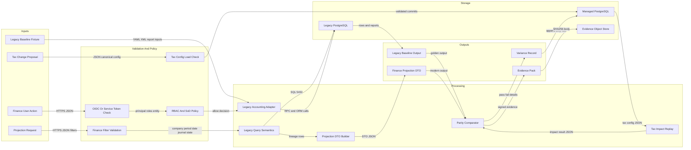
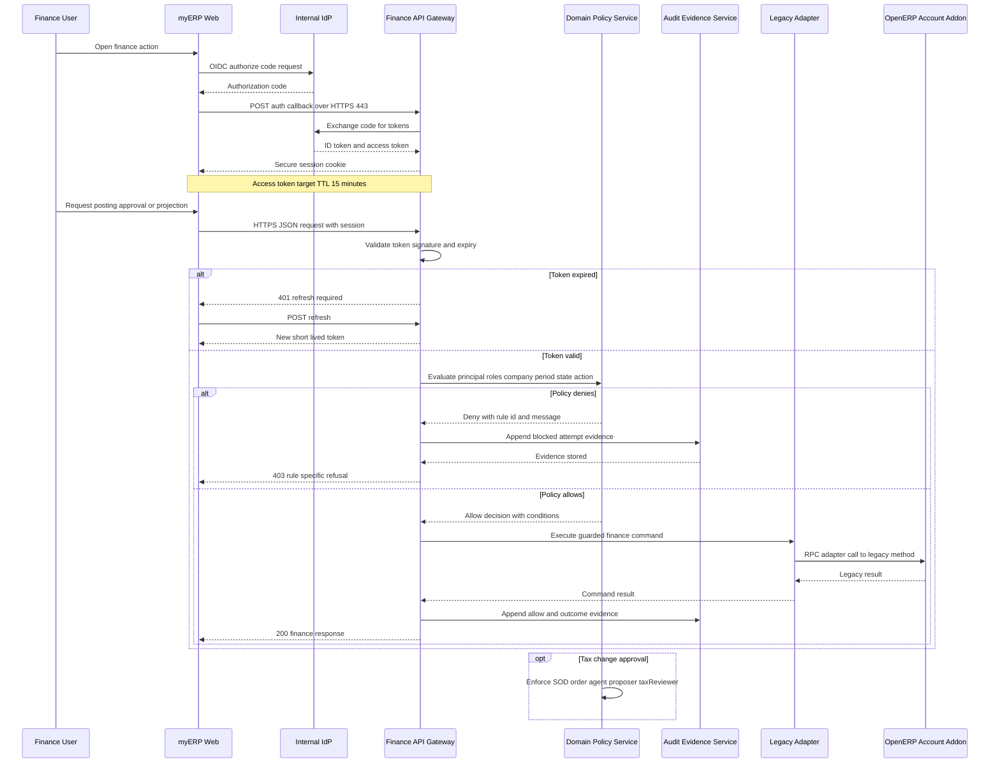
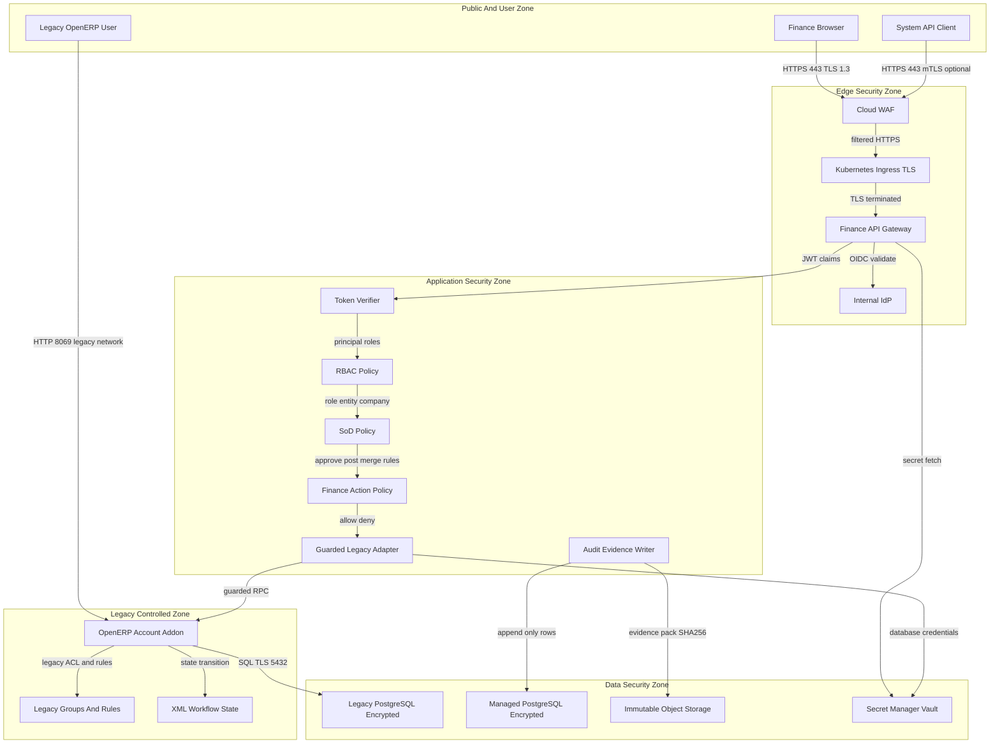
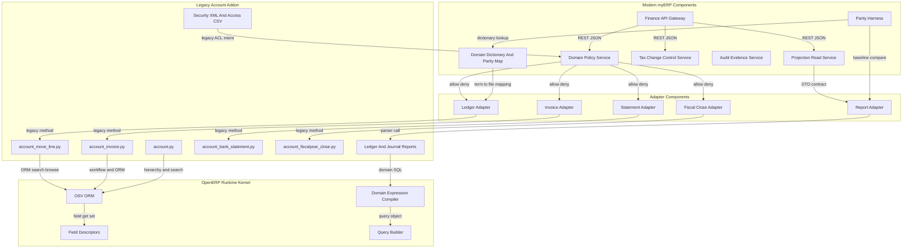
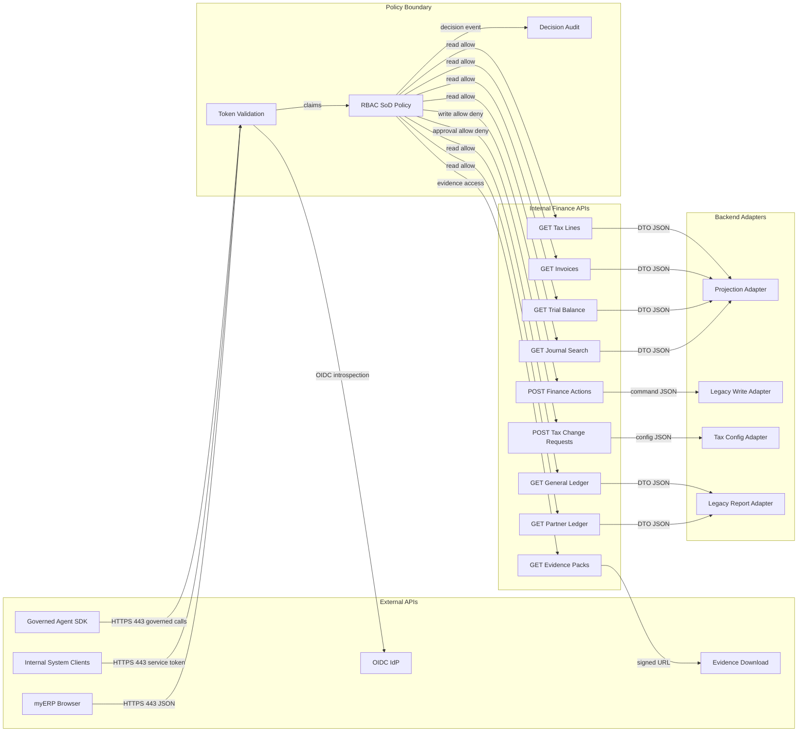
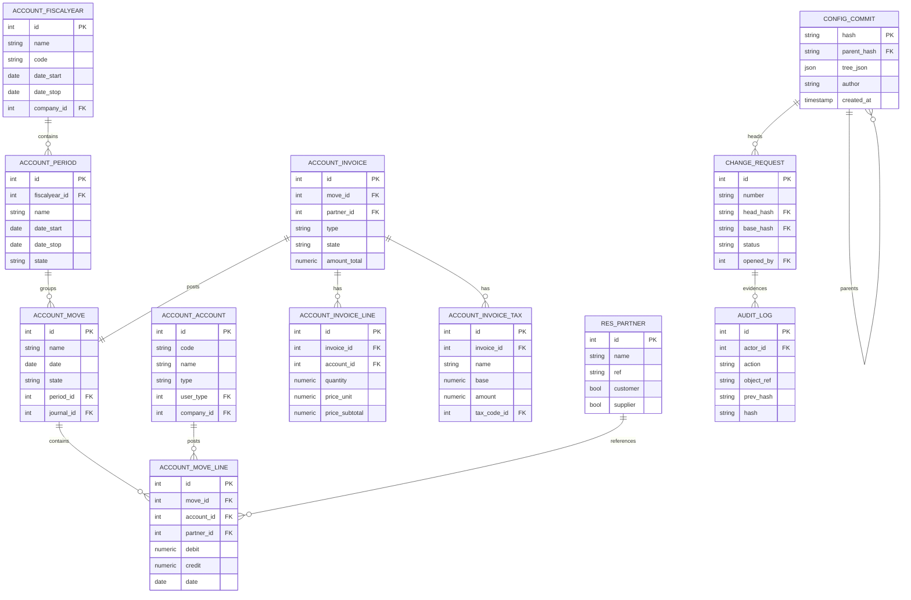

## Architecture Executive Summary

### Project Context
This project modernizes a legacy OpenERP 7.0 accounting subsystem into a secure, parity-tested myERP finance platform. The current system is a Python 2-era OpenERP monolith centered on `legacy/openerp-7.0/addons/account`, with accounting models, XML workflows and views, RML reports, YAML scenarios, and the OpenERP OSV ORM runtime under `legacy/openerp-7.0/openerp/osv`. The primary users are accountants, finance operators, controllers, tax reviewers, auditors, modernization engineers, and future API consumers.

### Current to Target Transformation
The current architecture relies on OpenERP model methods, workflow XML, UI group visibility, context-driven SQL filters, and report parsers. High-value accounting semantics already exist in invoice posting, journal items, fiscal periods, reconciliation, fiscal-year close, tax reporting, and general-ledger reporting. The target architecture keeps the legacy system authoritative during transition, wraps it behind explicit adapters, introduces OIDC-backed identity and server-side RBAC and SoD policy enforcement, adds projection-oriented finance APIs, and builds a Python 3.14-compatible modernization layer deployed on Kubernetes with managed PostgreSQL and managed object storage.

### Architectural Philosophy
1. **Parity before authority:** no modern slice becomes authoritative until legacy and modern outputs match for P0 accounting invariants.
2. **Policy before production writes:** finance writes must pass central identity, RBAC, company, period, state, and audit checks before mutation.
3. **Adapters before extraction:** high-gravity OpenERP APIs such as `search`, `create`, `write`, `_query_get`, and workflow methods are wrapped before being replaced.
4. **Projection over browse coupling:** modern consumers receive narrow DTOs instead of dynamic OpenERP browse records and context-heavy objects.
5. **Auditability without overclaiming compliance:** Release 1 targets internal-control readiness, segregation of duties, immutable evidence, and re-performance support, but does not claim formal certification.

### Architecture Decision Records
| Decision | Choice | Alternatives Considered | Rationale | Trade-offs |
|---|---|---|---|---|
| Modernization strategy | Incremental adapter and shadow parity migration | Big-bang rewrite: faster theoretical cleanup but unacceptable accounting regression risk. In-place OpenERP upgrade: less custom code but still inherits framework coupling and Python 2-era semantics. | Requirements demand shadow/parity comparison and block cutover on P0 mismatches. | Longer coexistence period and dual operating cost. |
| Runtime direction | Python 3.14-compatible finance service layer around legacy adapters | Stay on OpenERP 7: lowest immediate change but unsupported. Full modern ERP replacement: broad capability but high migration risk. | Target must move off Python 2 and preserve accounting invariants slice by slice. | Requires adapter contracts and careful data lineage. |
| Auth model | Internal IdP OIDC for humans, short-lived service tokens for systems, server-side RBAC and SoD | Caller-provided `X-Actor`: simple but not a trust boundary. Legacy groups only: useful intent but not sufficient for modern APIs. | Production finance writes must reject caller-controlled identity and produce refused-action evidence. | Higher implementation and operational complexity. |
| Read access | Projection-oriented APIs for journal search, trial balance, invoices, tax lines, partner ledger, and general ledger | Expose OpenERP browse objects: quick but highly coupled. Direct SQL views only: performant but weak domain contracts. | Requirements specify six projections with DTO fields, filters, lineage, and parity tests. | Requires explicit projection contracts and fixtures. |
| Tax change control | Versioned configuration commits, change requests, checks, reviews, ref log, and audit log | In-place tax edits: simple but unauditable. External Git only: strong versioning but weak business workflow integration. | Release 1 must combine parity foundations with governed tax configuration change-review workflow. | New data model and evidence pipeline are required. |
| Deployment | Single-region Kubernetes with managed PostgreSQL and object storage plus warm standby | VM-based legacy hosting: simpler for old stack but weak rollout controls. Serverless-only: unsuitable for legacy coexistence and batch parity runs. | User decisions require Kubernetes, managed data services, warm standby, OpenTelemetry, secrets rotation, and Forge Shipping. | Platform maturity and runbooks are required. |

### Intent Alignment
The architecture directly serves the seven intent features: central authentication and authorization, incremental migration off OpenERP 7, centralized domain policy, projection read APIs, ORM hub classification and adapters, canonical finance dictionary with parity mapping, and an accounting parity harness.

```mermaid

```

---

## System Architecture Overview

### Current State
The current accounting subsystem is an OpenERP 7.0 monolith. User interaction enters through XML-defined menus, views, wizards, and workflows. Business logic is concentrated in Python model classes such as `account.invoice`, `account.move.line`, `account.account`, bank statement models, report parsers, and fiscal close wizards. Persistence is PostgreSQL through OSV ORM and direct SQL. Reporting is RML-based, with report parsers using `report_sxw` and helper classes.

### Target State
The target architecture introduces a myERP finance layer without immediately replacing the legacy kernel. The finance API gateway terminates authenticated access, invokes domain policy, and routes reads to projection services and writes to guarded command adapters. Legacy OpenERP remains authoritative during shadow mode. The parity service runs legacy baselines and modern projections side by side. The tax configuration service owns versioned tax commits, change requests, impact checks, reviews, ref logs, and audit events. Managed PostgreSQL stores modern service state, while legacy PostgreSQL remains available for comparison until slice cutover.

### Why This Shape
A microservice rewrite would over-distribute highly coupled accounting invariants too early. A pure in-place refactor would not solve unsupported runtime or auth boundaries. The selected architecture forms a controlled strangler pattern: add a modern perimeter, centralize policy, introduce stable read contracts, and then migrate business slices only after parity evidence and finance sign-off. This design isolates the most volatile modernization concerns while respecting the heavy coupling around `_query_get`, ORM browse behavior, report parsers, and fiscal close SQL.

```mermaid
flowchart TD
  subgraph clientLayer["Client Layer"]
    legacyWeb["OpenERP Web Client"]
    myerpWeb["myERP Finance Web"]
    apiConsumer["Finance API Consumer"]
    auditor["Auditor Evidence User"]
  end
  subgraph edgeLayer["Edge And Identity Layer"]
    ingress["Kubernetes Ingress"]
    oidc["Internal IdP OIDC"]
    gateway["Finance API Gateway"]
    svcToken["Service Token Verifier"]
  end
  subgraph modernLayer["Modern Finance Layer"]
    policy["Domain Policy Service"]
    projections["Projection Read Service"]
    taxConfig["Tax Change Control Service"]
    parity["Parity Harness Service"]
    adapters["Legacy Accounting Adapters"]
    audit["Audit Evidence Service"]
  end
  subgraph legacyLayer["Legacy OpenERP Layer"]
    openerp["OpenERP 7 Account Addon"]
    osv["OSV ORM Runtime"]
    reports["RML Report Parsers"]
    workflows["XML Workflows And Views"]
  end
  subgraph dataLayer["Data Layer"]
    legacyDb["Legacy PostgreSQL"]
    modernDb["Managed PostgreSQL"]
    objectStore["Managed Object Storage"]
    vault["Cloud Secret Manager"]
  end
  legacyWeb -->|"HTTP 8069 legacy UI"| openerp
  myerpWeb -->|"HTTPS 443 OIDC"| ingress
  apiConsumer -->|"HTTPS 443 JSON"| ingress
  auditor -->|"HTTPS 443 evidence views"| ingress
  ingress -->|"TLS 443"| gateway
  gateway -->|"OIDC code flow"| oidc
  gateway -->|"JWT introspection"| svcToken
  gateway -->|"JSON policy decision"| policy
  gateway -->|"REST JSON reads"| projections
  gateway -->|"REST JSON tax workflow"| taxConfig
  policy -->|"allow deny decision"| adapters
  adapters -->|"RPC adapter calls"| openerp
  parity -->|"legacy baseline read"| reports
  parity -->|"modern projection read"| projections
  openerp -->|"ORM SQL 5432"| legacyDb
  osv -->|"SQL 5432"| legacyDb
  projections -->|"SQL 5432"| modernDb
  taxConfig -->|"SQL 5432"| modernDb
  audit -->|"append only events"| modernDb
  audit -->|"evidence packs"| objectStore
  gateway -->|"runtime secrets"| vault
```

---

## Data Flow Diagram

### Data Flow Responsibilities
The architecture separates three flows that are currently tangled in OpenERP: operational accounting writes, projection reads, and tax configuration governance. Operational writes continue to pass through legacy workflows while the modern layer is in shadow mode. Projection reads transform legacy accounting tables and report semantics into stable DTOs. Tax configuration changes follow a separate governed flow with versioned commits, checks, reviews, merge gates, immutable ref logs, and audit logs.

### Legacy Semantics Preserved
The most important legacy data contract is `account.move.line._query_get`. It accepts context keys for company, fiscal year, date range, period range, journal IDs, move state, chart account, and initial-balance logic. Reports such as partner ledger and journal printing concatenate that query into report SQL. Therefore, modern projections must not simply query tables by date; they must preserve the same fiscal-year, period, move-state, journal, company, and initial-balance behavior.

### Target Flow
The modern read service receives a projection request, validates filters, builds a canonical filter object, executes adapter-backed legacy baseline extraction, produces a DTO projection, and sends results to parity comparison. During shadow mode, legacy output remains authoritative and variances are stored. After sign-off, selected read projections can become read-authoritative. Write-capable flows require identity and policy decisions before invoking legacy adapters or future modern commands.

### Failure Handling
Unsupported filter combinations fail closed with business-readable messages. Evidence write failures block sensitive actions. P0 parity variance blocks cutover. Impact replay must complete within the documented Release 1 target for the seed dataset.



---

## Authentication & Authorization Flow

### Current Security Posture
The legacy accounting module contains security intent through XML groups, model access, record rules, UI groups, and workflow visibility. `account_security.xml` defines groups for invoicing, accountants, and financial managers, and multi-company record rules for account moves, move lines, periods, fiscal years, journals, invoices, taxes, and bank statements. However, sensitive Python methods inspected in fiscal close, bank statement posting, invoice lifecycle, and report flows do not show a single centralized server-side policy module.

### Target Security Flow
The target architecture places identity verification at the gateway boundary. Human users authenticate with the internal IdP through OIDC authorization code flow. System clients use short-lived service tokens. The finance application maps verified principals to roles, entity scope, company scope, and principal kind. Every production write-capable finance action invokes the domain policy layer before legacy adapters or modern commands execute.

### Policy Semantics
Policy checks include role, company, accounting period, document state, segregation of duties, and audit preconditions. For tax changes, the required order is SOD-02 agent denial, SOD-01 proposer denial, and SOD-03 tax reviewer role requirement. For posting and close actions, policy must protect invoice posting, journal posting, bank statement confirmation, reconciliation, reversal, and fiscal close. A denied action is not hidden; it is returned to the caller with a rule-specific message and stored as evidence.

### Token Targets
Access tokens should be short lived with a target TTL of 15 minutes. Service tokens should be scoped to one system capability and rotate at least every 24 hours. Refresh tokens, if used for humans, should be stored in secure httpOnly cookies and rotated on use.



---

## Security Architecture

### Defense in Depth
Security architecture must improve the current posture without breaking finance operations. The legacy module already contains access intent through groups and record rules, especially multi-company domains over core accounting models. These controls should be treated as source material for the modern authorization model, not as the only enforcement mechanism. The target design adds identity, token validation, application policy, immutable evidence, secrets rotation, encryption, and network segmentation.

### Trust Boundaries
The first trust transition is from browser or API client to Kubernetes ingress. The second is from authenticated gateway to application policy. The third is from policy-approved commands to legacy adapters. The final transition is from services to managed databases and object storage. Production finance writes must never cross from edge to mutation without a policy decision and audit evidence.

### Sensitive Operations
Invoice posting, journal posting, bank and cash statement confirmation, reconciliation, fiscal close, reversal, tax configuration merge, and tax approval are high-risk. Each must be represented as a named business action in the policy module, not as generic `write` or `execute` calls. Where legacy paths remain active, adapter wrappers should fail closed when policy context is absent.

### Cryptography and Secrets
All external traffic uses TLS 1.3. Database connections use TLS and managed encryption at rest. Evidence packs are stored in object storage with object lock or equivalent immutability. Runtime secrets live in cloud secret manager or Vault with rotation, and no secret values are embedded in source or logs.



---

## Deployment Architecture

### Deployment Direction
The target deployment is a single-region Kubernetes platform with managed PostgreSQL and managed object storage, plus a warm standby in the same cloud or secondary region. The legacy OpenERP runtime may initially remain in its existing hosting model, but the modernization layer should be deployed using the same pipeline discipline from the start. The deployment approach must support repeatable parity runs, safe canaries, approval gates, secrets rotation, and rollback by capability slice.

### Forge Shipping Pipeline
The pipeline uses Forge Shipping step catalog identifiers and treats security scans as first-class gates. Build includes Python service packaging and container image build. Scan includes source quality, dependency vulnerabilities, secret scanning, static analysis, and container image scanning. Push stores signed images in a registry. Deploy uses Kubernetes and Helm, with GitOps or Argo CD promotion if available. Post-deploy tests include generic smoke tests, parity tests, and traffic replay for read projections.

### Promotion Model
Development deploys on every merged change. Staging requires passing unit, integration, parity, and security gates. Production requires manual approval by engineering and finance control owner for slices that affect accounting outputs or finance writes. Cutover is controlled by feature flags: shadow-only, read-canary, read-authoritative, write-pilot, and write-authoritative.

### Rollback
Rollback is by immutable image version and feature flag. If a P0 parity variance, evidence write failure, or authorization bypass is detected, the affected slice reverts to shadow-only and legacy remains authoritative.

```mermaid
flowchart LR
  subgraph sourceStage["Source"]
    pr["Git PR"]
    commit["Git Commit"]
    tag["Release Tag"]
  end
  subgraph buildStage["Build"]
    buildPython["build:python"]
    buildDocker["build:docker"]
    unitTests["test:generic Unit"]
    parityUnit["test:generic Parity Fixtures"]
  end
  subgraph scanStage["Security Scan"]
    sonarqube["scan:sonarqube"]
    snyk["scan:snyk"]
    gitleaks["scan:gitleaks"]
    semgrep["scan:semgrep"]
    grype["scan:grype"]
    scanMerge["Scan Results Gate"]
  end
  subgraph pushStage["Push"]
    registry["push:ecr Container Registry"]
    attest["Image Signature And SBOM"]
  end
  subgraph deployStage["Deploy"]
    dev["deploy:kubernetes Dev"]
    staging["deploy:helm Staging"]
    argocd["deploy:argocd Promotion"]
    prod["deploy:kubernetes Prod"]
  end
  subgraph gateStage["Gate"]
    financeGate["Manual Finance Approval"]
    securityGate["Manual Security Approval"]
    releaseGate["Go No Go Gate"]
  end
  subgraph testStage["Test"]
    smoke["test:generic Smoke"]
    speedscale["test:speedscale Replay"]
    accelq["test:accelq UAT"]
    parity["test:generic Accounting Parity"]
  end
  pr -->|"pull request"| buildPython
  commit -->|"main commit"| buildPython
  tag -->|"release tag"| buildDocker
  buildPython -->|"wheel artifact"| unitTests
  unitTests -->|"passed"| parityUnit
  parityUnit -->|"container context"| buildDocker
  buildDocker -->|"image digest"| sonarqube
  buildDocker -->|"image digest"| snyk
  buildDocker -->|"source tree"| gitleaks
  buildDocker -->|"source tree"| semgrep
  buildDocker -->|"container image"| grype
  sonarqube -->|"quality result"| scanMerge
  snyk -->|"dependency result"| scanMerge
  gitleaks -->|"secret result"| scanMerge
  semgrep -->|"static result"| scanMerge
  grype -->|"image result"| scanMerge
  scanMerge -->|"approved artifact"| registry
  registry -->|"digest and tag"| attest
  attest -->|"signed image"| dev
  dev -->|"dev URL"| smoke
  smoke -->|"pass"| staging
  staging -->|"staging URL"| speedscale
  speedscale -->|"traffic replay pass"| parity
  parity -->|"100 percent P0 pass"| financeGate
  financeGate -->|"approval"| securityGate
  securityGate -->|"approval"| releaseGate
  releaseGate -->|"promotion"| argocd
  argocd -->|"sync"| prod
  prod -->|"production URL"| accelq
```



---

## Component Architecture

### Component Boundaries
The legacy system has natural but incomplete domain boundaries: accounting master data, journal items and ledger queries, invoice lifecycle, statements and reconciliation, fiscal close, financial reports, security metadata, and the OSV runtime. These are not independent services today; they are coupled through `pool.get`, browse records, XML views, workflow transitions, and shared SQL tables. The target architecture converts those implicit boundaries into explicit adapter and domain modules.

### Legacy Core Components
`account_move_line.py` is the ledger query and reconciliation gravity center. `account_invoice.py` owns invoice totals, residuals, payment linkages, and state. `account.py` owns payment terms, account types, account hierarchy, and report-type mapping. `account_bank_statement.py` creates accounting moves from statement lines. `account_fiscalyear_close.py` orchestrates fiscal close and opening entries. Report parsers such as `account_partner_ledger.py`, `account_journal.py`, and `account_general_ledger.py` expose the read semantics that projections must preserve.

### Modern Components
The modern component model introduces a Finance API Gateway, Domain Policy Service, Projection Read Service, Parity Harness, Tax Configuration Service, Audit Evidence Service, and Legacy Adapter Layer. Pure domain modules should own tax compute parity, projection contracts, policy decisions, and dictionary mappings. The OSV runtime remains a stable kernel until enough capability slices are extracted and parity-tested.

### Trade-off
This design keeps legacy coupling contained, but it does not immediately reduce all monolith complexity. The key benefit is controlled blast radius: capability slices can migrate behind stable contracts rather than modifying every high-fan-in ORM path.



---

## API Integration Architecture

### API Shape
The current repository does not expose modern REST endpoints for accounting. OpenERP exposes behavior through web UI actions, XML-RPC style object services, model methods, workflow transitions, wizards, and report actions. The target architecture introduces explicit API groups without directly exporting legacy browse records or generic ORM verbs.

### Internal API Groups
Read APIs include journal search, trial balance, invoices, tax lines, partner ledger, and general ledger. Write APIs are narrower and policy-guarded: post invoice, post journal, confirm statement, reconcile, reverse, fiscal close, propose tax change, approve tax change, merge tax change, and export evidence. Each write API carries an authenticated principal from the gateway and never accepts a caller-controlled actor as the durable identity.

### External Integrations
External integrations should remain limited in Release 1. The internal IdP provides OIDC. The official Anthropic SDK appears in target planning for a governed agent principal, but agent actions are bound by the same API and SoD rules. Object storage provides evidence pack download. Legacy OpenERP adapters are internal-only and must not be exposed as public generic execute endpoints.

### Contracts
Projection APIs return versioned DTOs with explicit filters, lineage fields, and empty-state errors. Target latency should be less than 500 ms p95 for seed-scale read projections and under 2 seconds for screens on seed data. Tax impact replay has the documented under 1 second Release 1 target for the 70-document seed.



---

## Database Schema Analysis

### Data Architecture Basis
No connected live database DDL was available, so this schema analysis is derived from legacy model definitions, SQL references, XML seed data, report queries, and the target Release 1 data model. The current OpenERP schema is table-centered around `account_move_line`, `account_move`, `account_account`, `account_period`, `account_fiscalyear`, `account_invoice`, `account_invoice_line`, `account_invoice_tax`, `account_journal`, `res_partner`, `account_tax`, and tax code tables.

### Current Schema Characteristics
The accounting ledger is represented by moves and move lines. Invoices link to journal entries through `move_id`, and reports derive balances from move lines joined to account, move, period, partner, journal, and tax code structures. Fiscal close directly inserts into `account_move_line` and updates reconciliation IDs. Report parsers use SQL against `account_move_line` and contextual filters rather than isolated read models.

### Target Schema Additions
The target myERP schema adds entities, principals, documents, tax lines, journal entries, journal lines, tax registrations, jurisdictions, rate components, configuration commits, refs, ref logs, change requests, checks, reviews, and audit logs. These modern tables support governed configuration, immutable evidence, projection lineage, and replay. Release 1 should avoid destructive migration. Instead, seed modern tables from controlled extracts and keep lineage back to legacy IDs.

### Migration Rules
Every modern projection row must preserve source lineage, source company or entity, source period or date filters, currency, move state, and calculation version. Dual-write should be avoided during early phases; use shadow reads and controlled write cutover by slice only after parity and rollback gates pass.



---

## Technology Stack Summary

### Stack Assessment
The current stack is valuable because it encodes accounting behavior, but much of it is unsupported or unsuitable as the long-term foundation for finance APIs. The target stack should modernize runtime, deployment, security, observability, and evidence storage while retaining PostgreSQL and preserving accounting semantics through adapters and parity tests.

| Layer | Technology | Version | Status | Rationale |
|---|---|---:|---|---|
| Legacy ERP runtime | OpenERP | 7.0 | outdated | Core accounting behavior exists, but the runtime is legacy and tightly coupled to OSV ORM and XML workflows. |
| Legacy backend language | Python | 2 era | outdated | Python 2.7 has been unsupported since 2020 and blocks modern security and tooling. |
| Target backend language | Python | 3.14 compatible | modern | Required target runtime direction for modernization services and pure domain modules. |
| Legacy ORM | OpenERP OSV ORM | 7.0 era | outdated | Provides PostgreSQL persistence and caching but mixes business logic, UI metadata, and data access. |
| Database | PostgreSQL | managed target | acceptable | Current ORM and SQL reports depend on PostgreSQL; managed PostgreSQL is suitable for target services. |
| Reporting | RML report templates | legacy | outdated | Existing reports preserve finance semantics but should become parity baselines and projection sources. |
| UI definition | OpenERP XML views and workflows | 7.0 era | outdated | Defines current surface and workflow states but should not be the sole security boundary. |
| Tests | YAML scenarios and XML asserts | legacy | acceptable | Existing behavior tests are useful seeds for a modern parity harness. |
| Identity | Internal IdP OIDC OAuth2 | current target | modern | Required for humans; replaces caller-controlled actor headers for production writes. |
| Service auth | Short-lived service tokens | current target | modern | Required for system clients with scoped capabilities. |
| Deployment | Kubernetes | current target | modern | User-selected target for single-region deployment and controlled rollout. |
| Object storage | Managed object storage | current target | modern | Required for evidence packs and artifacts. |
| Observability | OpenTelemetry logs metrics traces | current target | modern | Required for rollout health, parity monitoring, and incident diagnostics. |
| Secrets | Cloud secret manager or Vault | current target | modern | Required for rotation and runtime secret isolation. |
| Pipeline | Forge Shipping | current target | modern | Required delivery engine and pipeline catalog. |

### Technology Choice Rationale
The design deliberately keeps PostgreSQL because legacy accounting data and report semantics are PostgreSQL-backed. It modernizes around the monolith rather than forcing an immediate database rewrite. Python 3.14-compatible services are preferred because they align with the modernization target and allow porting pure accounting modules while retaining Python domain expertise. Kubernetes and managed services add operational discipline without requiring every legacy workflow to be rewritten in Release 1.

```mermaid

```

---

## Architectural Concerns & Recommendations

### Priority Concerns
The highest architectural concern is not a missing feature; it is uncontrolled semantic drift. Accounting behavior is distributed across model methods, report SQL, workflow XML, view state, and test data. The target architecture must therefore treat reports, query builders, fiscal close, invoice state, and reconciliation as contract surfaces.

| # | Concern | Severity | Impact | Recommendation | Effort |
|---:|---|---|---|---|---|
| 1 | Unsupported OpenERP 7 and Python 2-era runtime | Critical | Security and maintainability risk, limited dependency upgrades, staffing difficulty | Create Python 3.14-compatible service layer and migrate by parity-tested slices | XL |
| 2 | No centralized production auth boundary for finance writes | Critical | Unauthorized posting, reconciliation, close, tax merge, or reversal could mutate system-of-record state | Enforce OIDC service tokens RBAC SoD and action policy before adapters | L |
| 3 | Context-sensitive `_query_get` semantics are implicit | High | Report totals and projection outputs can drift by company, fiscal year, period, date, journal, state, or initial balance | Define canonical filter dictionary and parity tests for every projection | L |
| 4 | Generic ORM verbs hide business intent | High | Changes to search write create execute paths have broad blast radius | Classify OSV kernel as stable and introduce business-named adapters | L |
| 5 | Direct SQL in fiscal close and reports | High | Bypasses some ORM safeguards and complicates audit and migration | Encapsulate SQL in adapters, parameterize, and add reconciliation and close parity tests | M |
| 6 | Security intent spread across XML groups, rules, and UI visibility | High | UI controls may be mistaken for sufficient server-side authorization | Map legacy groups and record rules into executable policy rules | M |
| 7 | Sparse parity coverage relative to accounting scope | High | Cutover could regress balances, tax, reports, posting, or widgets | Build parity harness before replacing runtime behavior | L |
| 8 | RML report stack is legacy | Medium | Hard to maintain and difficult to expose to APIs | Keep as baseline, then replace with projection DTOs and modern rendering | M |
| 9 | Tax configuration changes lack durable review and impact evidence | High | In-place changes can affect issued documents without approval trail | Implement versioned tax config, checks, impact replay, reviews, ref log, audit log | L |
| 10 | No evidenced modern observability | Medium | Migration health and incident diagnosis would be weak | Add OpenTelemetry spans for policy decisions, adapter calls, parity runs, and tax replay | M |

### Recommendation Summary
Start with contracts and controls, not code replacement. The first implementation wave should produce the domain dictionary, parity map, projection contracts, policy matrix, and baseline fixtures. Only after that should modern components replace runtime behavior.

```mermaid

```

---

## Quality Attributes & NFR Matrix

### NFR Strategy
The target NFRs must reflect finance-system risk rather than generic web targets. Correctness, authorization, auditability, and rollback are higher priority than raw throughput in Release 1. Performance targets are still necessary, but no authoritative finance cutover should occur unless P0 parity is complete and security controls are operating.

| Attribute | Target | Current | Gap | Priority |
|---|---|---|---|---|
| Performance response time | Projection screens under 2 seconds on seed data and p95 read API under 500 ms for seed-scale reads | Legacy reports execute through RML parsers and SQL without modern API budgets | Need projection contracts, benchmarks, and caching only after semantics are proven | High |
| Tax replay performance | Impact replay under 1 second for 70 documents and 608 tax lines | No governed replay engine exists in legacy tax edits | Need deterministic replay and stored answer-key comparisons | High |
| Throughput | Release 1 target 50 concurrent finance users and 10 concurrent parity or replay jobs in staging | No modern load profile evidenced | Need measured baseline and capacity tests during canary | Medium |
| Availability | 99.5 percent Release 1 service SLO with warm standby RPO up to 1 hour and RTO up to 2 hours | Legacy deployment and DR posture not evidenced | Need backups, restore drills, health checks, and standby runbook | High |
| Scalability | Architecture supports scoped replay by entity and month, future path to 100000 documents interactively | Current code optimized around direct SQL and ORM caches but not modern horizontal scaling | Need job partitioning and query budgets after R1 | Medium |
| Security | 0 production write-capable workflows trust caller-controlled actor identity | Legacy groups and record rules exist but central auth boundary is not evidenced | Need OIDC, service tokens, policy service, deny evidence, and adapter guard tests | Critical |
| Correctness | 100 percent P0 parity pass before cutover and 0 journal imbalance tolerance in tested currency | Legacy behavior exists but is spread across models reports workflows and tests | Need complete baseline capture and variance workflow | Critical |
| Auditability | 100 percent blocked approval or merge attempts store rule actor object timestamp and message | Legacy evidence scattered across UI state and reports | Need append-only audit log, ref log, evidence pack, and verification | Critical |
| Maintainability | Every R1 canonical term maps to model, workflow, report, function, and parity tests | Terminology spans OpenERP 7 names and myERP target terms | Need domain dictionary and parity map before build starts | High |

### Validation Targets
P0 parity failures block cutover. Authorization bypass findings block production write enablement. Evidence-chain verification must pass before release. Rollback rehearsal must pass before any write-authoritative slice is enabled.

```mermaid

```

---

## Migration & Transformation Plan

### Migration Phases
| Phase | Duration Estimate | Scope | Entry Criteria | Exit Criteria | Rollback Strategy |
|---|---:|---|---|---|---|
| Phase 0 Scope Lock and Baseline Inventory | 1 week | Confirm seven-feature scope, stakeholders, baseline datasets, legacy report inventory, and target runtime decision log | Intent and Release 1 anchors approved | All seven features mapped to owners, code areas, and acceptance gates | Stop implementation and return to scope review if unselected themes enter MVP |
| Phase 1 Domain Dictionary and Parity Map | 3 weeks | Map canonical terms to legacy models, security XML, workflows, reports, functions, fixtures, and tests | Baseline inventory complete | Dictionary covers ledger, invoice, journal item, period, fiscal close, tax, trial balance, partner ledger, general ledger | Keep legacy authoritative and defer extraction if terms remain unmapped |
| Phase 2 Parity Harness Foundation | 4 weeks | Capture golden outputs for balanced entries, tax compute, invoice posting, statement posting, reconciliation, fiscal close, report totals, workflow interactions, and selected widgets | Dictionary and fixture scope approved | 100 percent P0 parity cases defined and runnable in CI and staging | Disable modern replacements and keep tests as baseline references |
| Phase 3 Security and Policy Pilot | 4 weeks | Implement OIDC integration, service tokens, RBAC, SoD, policy matrix, denied-action evidence, and guarded adapter pattern | Identity provider and role model approved | 0 pilot write paths bypass policy; all denied actions store evidence | Feature flag all write APIs to read-only or shadow-only |
| Phase 4 Tax Change Control Shadow MVP | 4 weeks | Implement config commits, refs, ref log, change requests, checks, reviews, impact replay, audit log, evidence packs | Parity harness foundation and policy pilot available | No-change replay matches seed, documented impact scenario matches answer key, SoD denial evidence passes | Leave tax configuration legacy-authoritative and disable merge to main |
| Phase 5 Projection Read Canary | 5 weeks | Implement journal search, trial balance, invoices, tax lines, partner ledger, and general ledger DTOs | Legacy filters and report semantics mapped | 6 of 6 projections pass parity with no unresolved P0 variance | Disable affected projection and route users to legacy report output |
| Phase 6 Controlled Write Cutover By Slice | 5 weeks | Enable write-authoritative slices only after parity, policy, audit, rollback, and finance sign-off | Canary successful and rollback rehearsed | Slice operates with 100 percent P0 parity, policy evidence, and controller sign-off | Revert feature flag to legacy authority and replay reconciliation checks |

### Coexistence Strategy
Legacy OpenERP remains authoritative until a slice passes parity and sign-off. The modern platform runs in shadow mode, reading legacy outputs and producing comparable DTOs. Legacy write paths are wrapped by adapters for pilot workflows rather than rewritten immediately. Modern tax configuration starts shadow-only until merge gates, impact replay, and SoD controls pass.

Data synchronization is extract-and-compare during early phases, not dual-write. Modern tables store configuration governance, audit evidence, projection outputs, and lineage references. Traffic routing uses feature flags by projection and action: shadow, canary, read-authoritative, write-pilot, and write-authoritative. Migration health monitoring tracks parity pass rate, P0 variance count, denied-action evidence success, policy bypass attempts, replay duration, API latency, adapter errors, and audit write failures.

### Validation Criteria
Each phase succeeds only when its objective evidence passes: data integrity control totals, balanced journals with zero tolerance, report parity, tax replay answer keys, policy deny and allow tests, audit verification, performance benchmarks, and finance UAT. Any P0 variance, authorization bypass, or evidence-chain failure blocks progression and returns the affected capability to shadow-only.

```mermaid

```