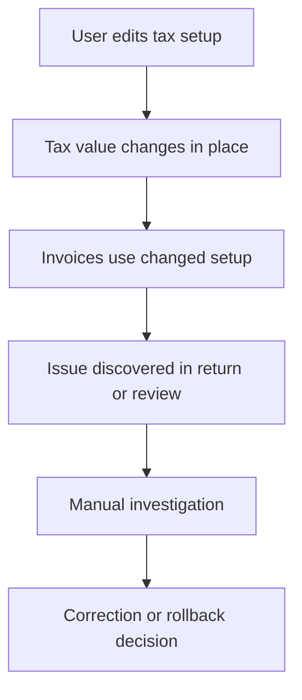
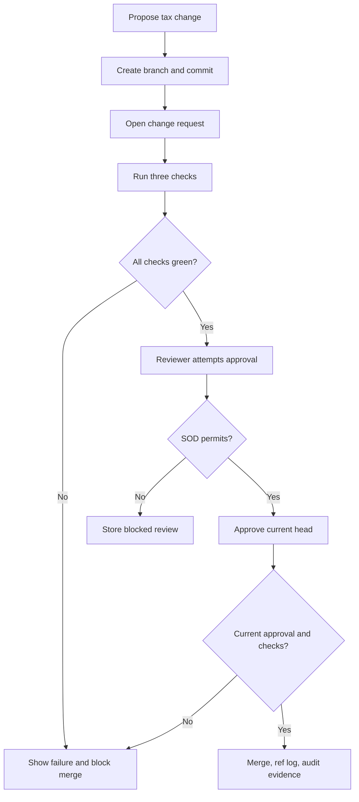
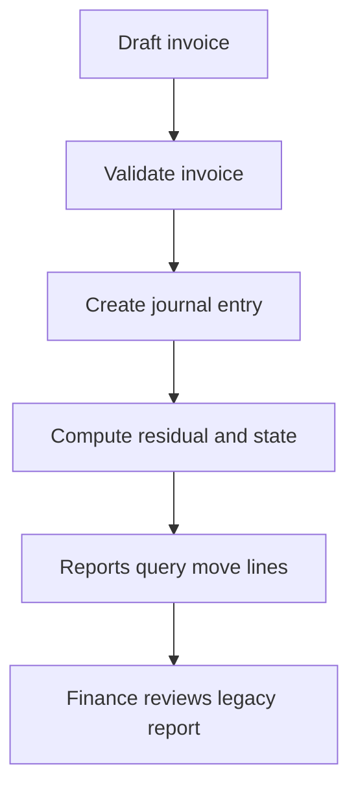
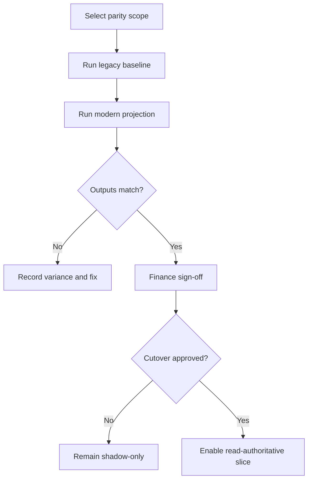
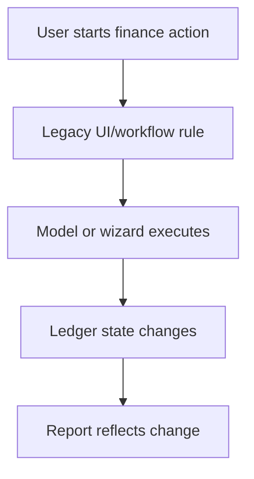
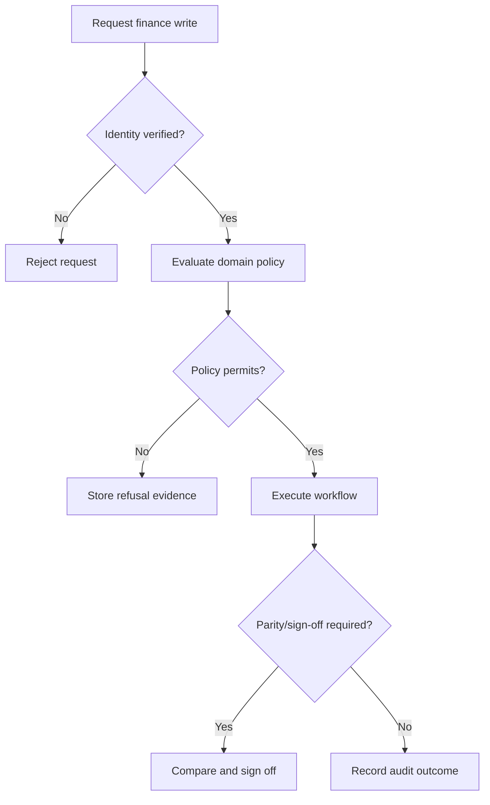
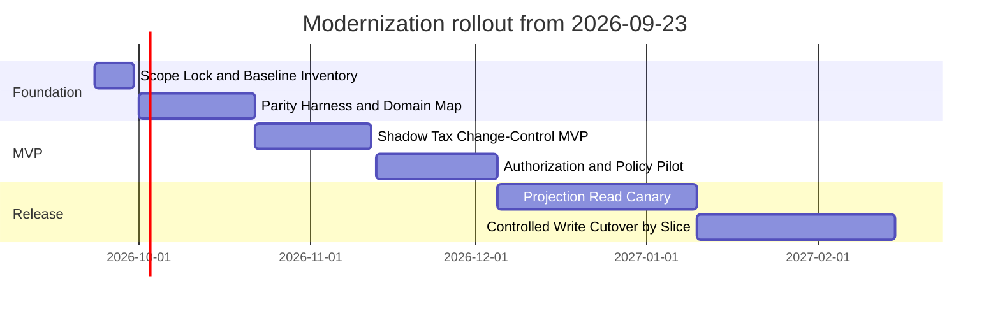

## Executive Summary

The current accounting subsystem is a legacy OpenERP 7.0/Python 2-era finance platform that still contains valuable accounting behavior: invoices, journal entries, fiscal periods, reconciliation, reports, chart-of-accounts setup, and tax computation. Its limitations are material for a finance system: security intent is distributed across access files and user interface rules, reporting depends on legacy query context, workflows are split across XML and model methods, and tax configuration changes are edited in place without a durable review, impact, or evidence trail.

The target state is a secure, parity-tested myERP finance modernization that preserves the ledger, invoices, trial balance, and legacy tax semantics while adding version-controlled tax configuration, change requests, impact replay, segregation-of-duties reviews, immutable logs, and stable finance read projections. Release 1 must be an integrated MVP: accounting parity foundations and tax change-control workflows ship together, with shadow/parity mode before any write-authoritative cutover.

The primary beneficiaries are controllers, accountants, tax reviewers, auditors, modernization engineers, and future API consumers. The value proposition is finance confidence: the organization can see exactly what a tax rule change would move before approval, prove sensitive controls operated, compare modern outputs against legacy behavior, and migrate away from unsupported runtime risk without a big-bang rewrite.

---

## Business Objectives and Success Criteria

| Objective | Current State (Before) | Target State (After) | Success Criteria | Measurement Method |
|---|---|---|---|---|
| Preserve accounting correctness during modernization | Ledger, invoice, report, and tax behavior exist in legacy code but are spread across models, reports, workflows, and tests | Shadow/parity mode compares modern outputs to legacy behavior before cutover | 100% of Release 1 parity checks pass before write-authoritative cutover; journal entries net to zero with 0 tolerance in each tested currency | Automated parity test run and sign-off report |
| Reduce unsupported runtime and migration risk | Current backend uses OpenERP 7.0/Python 2-era APIs and legacy OSV patterns | New modernization slices target Python 3.14-compatible services or a selected modern framework behind adapters | 7 of 7 selected modernization features have mapped requirements, owners, acceptance criteria, and rollout gates by the end of Phase 1 | PRD-Spec traceability review and delivery backlog audit |
| Establish enforceable finance authorization | Legacy permissions exist as groups, record rules, and model access rows; production trust boundary is not centralized | Production write-capable finance workflows require centrally enforced authentication and server-side authorization | 0 production write-capable workflows accept caller-controlled actor headers as the durable trust boundary | Security test suite and denied-action audit review |
| Govern tax configuration changes with impact evidence | Tax rates can be changed in place; impact on issued documents is not visible before approval | Tax changes occur through branch, diff, checks, review, merge, immutable ref log, and audit log | Impact replay over the R1 tax seed completes in under 1 second and reproduces the documented no-change baseline for 70 documents and 608 tax lines | Replay benchmark and answer-key comparison |
| Improve audit and internal-control readiness | Evidence is scattered across UI state, legacy workflow, and reports | Reviews, refusals, ref moves, and audit actions are append-only and reviewable | 100% of blocked approval attempts store the rule, actor, object, timestamp, and message; audit verification returns pass before release | Audit log verification and SOD scenario tests |
| Enable stable finance consumption without broad browse/context coupling | Reporting depends on dynamic browse objects and context-driven query fragments | Projection-oriented read views expose journal search, trial balance, invoices, tax lines, partner ledger, and general ledger | 6 named read projections are specified with filters, DTO fields, parity tests, and data lineage before implementation starts | Projection contract review and test coverage report |

---

## Personas and Stakeholders

| Name | Type | Role | Goals | Pain Points | How Served |
|---|---|---|---|---|---|
| Accountant / Finance Operator | Persona | Day-to-day user posting invoices, journals, statements, reconciliations, and close activities | Continue working accurately while modernization proceeds; trust totals and statuses | Legacy workflow behavior is distributed and modernization must not change financial results | Shadow/parity mode, unchanged legacy workflows during transition, and verified projection views |
| Finance Administrator / Controller | Persona | Owner of company, period, role, posting, and audit controls | Enforce role, company, period, state, and audit preconditions | Access control is scattered and write workflows lack one visible policy layer | Central domain policy layer, server-side authorization, blocked-action evidence |
| Tax Reviewer / Tax Technology Engineer | Persona | Reviews and proposes tax configuration changes | See diff, checks, impact replay, and current approval status before merge | Tax changes lack history, effective dates, review, and impact visibility | Versioned tax configuration, change requests, merge gates, and jurisdiction impact views |
| Auditor / Compliance Reviewer | Persona | Reviews financial correctness and control operation | Re-perform evidence, verify SOD, inspect audit/ref logs | Evidence is often screenshots or difficult traceability across legacy assets | Immutable review/ref/audit trails, parity maps, and evidence export-ready records |
| Modernization Engineer / Maintainer | Persona | Migrates legacy OpenERP behavior safely | Isolate seams, write tests, wrap framework hubs, avoid broad regressions | High coupling around generic ORM operations and legacy XML/RML workflows | Adapter requirements, domain dictionary, parity harness, and phased rollout gates |
| API Consumer / Future Integration | Persona | Consumes finance read/write capabilities | Use stable finance views and secure state transitions | Legacy browse/context objects are too dynamic and write APIs cannot rely on caller-selected identity | Narrow read projections and authenticated/authorized finance workflow contracts |
| CFO / VP Finance | Stakeholder | Executive sponsor | Reduce modernization and audit risk while preserving finance operations | Big-bang ERP replacement risk and unclear cutover confidence | Phased rollout, balanced scorecard, go/no-go gates, and executive-level KPIs |
| Security / Internal Controls Owner | Stakeholder | Governance owner for finance authorization and SOD | Ensure privileged actions are denied, allowed, and evidenced consistently | Legacy controls rely on UI visibility, groups, and implicit framework behavior | Central policy layer, audit events, SOD rules, and denied-action reporting |
| Engineering Leadership | Stakeholder | Delivery and architecture owner | Plan capacity, sequencing, and migration boundaries | Legacy runtime, Python 2-era patterns, and report/UI coupling increase delivery uncertainty | Migration waves, adapter boundaries, test gates, and framework hub classification |

---

## User Stories and Acceptance Criteria

| ID | As a... | I want to... | So that... | Priority | Acceptance Criteria |
|---|---|---|---|---|---|
| US-001 | Finance operator | Continue using existing accounting workflows during modernization | Daily finance work is not disrupted | P0 | Given legacy workflows remain active, When a migration slice enters shadow mode, Then users can still complete invoice review, ledger review, reconciliation, and reporting in the legacy system; Given modern results differ from legacy results, When the variance exceeds the approved tolerance, Then the slice remains non-authoritative and a variance record is opened. |
| US-002 | Controller | Require centrally enforced authentication and authorization for production finance writes | Sensitive accounting changes cannot be made by spoofed actors | P0 | Given a production write-capable finance action, When a caller provides only a caller-controlled actor value, Then the action is rejected; Given a verified identity with the required role, company, period, state, and audit preconditions, When the user attempts the same action, Then the policy layer allows it and records the decision. |
| US-003 | Controller | Apply one domain policy layer to posting and reversal workflows | Invoice, journal, statement, reconciliation, close, and reversal controls are consistent | P0 | Given an invoice, journal entry, bank statement, reconciliation, fiscal close, or reversal action, When the action is requested, Then the policy layer evaluates role, company, period, document state, and audit preconditions; Given a failed condition, When the request is refused, Then the first refusal reason is visible and stored. |
| US-004 | Tax reviewer | Review tax configuration changes through diff, checks, and impact replay | I approve the financial effect, not just a setup change | P0 | Given a proposed tax change, When checks run, Then merge-clean, config-loads, and impact results are stored for the current head; Given the New York City example, When the impact check runs on the R1 seed, Then it reports 6 of 70 documents moving by USD 13,103.51; Given no edit, Then it reports no change across 70 documents. |
| US-005 | Auditor | See immutable evidence for approvals, refusals, merges, and ref moves | I can verify internal controls operated | P0 | Given an agent attempts to approve, When SOD-02 applies, Then the attempt is blocked and stored with actor, rule, message, time, and change request; Given the proposer attempts to approve, When SOD-01 applies, Then the refusal is stored; Given an authorized reviewer approves and merges, Then the approval, merge, ref movement, and audit row are retained. |
| US-006 | Modernization engineer | Map business terms to legacy models, workflows, reports, and functions | Migration stories become testable contracts instead of rediscovery work | P1 | Given a canonical term such as invoice, journal item, fiscal year close, tax, trial balance, or partner ledger, When the parity map is reviewed, Then it links the term to legacy models, XML rules or workflows, reports, functions, and parity tests; Given an unmapped term, Then it is flagged before implementation starts. |
| US-007 | API consumer | Use projection-oriented read views for finance data | Integrations do not depend on legacy browse/context objects | P1 | Given a consumer requests journal search, trial balance, invoices, tax lines, partner ledger, or general ledger, When filters are supplied, Then the output uses narrow DTO-style fields and preserves company, fiscal year, period/date, journal, move-state, and initial-balance semantics; Given projection output is generated, Then parity tests compare it to legacy reports. |
| US-008 | Modernization engineer | Classify OpenERP hubs and wrap accounting operations behind adapters | Capability migration does not require rewriting the whole legacy kernel | P1 | Given framework and accounting hotspots are assessed, When migration boundaries are defined, Then generic search, write, create, execute, expression parsing, and field access paths are classified as stable kernel or extraction candidates; Given an accounting capability is migrated, Then it calls a narrow adapter with explicit business intent rather than exposing generic ORM verbs. |
| US-009 | QA / release manager | Run a parity-test harness before replacing legacy behavior | Regression risk is measurable before cutover | P0 | Given a release candidate, When the parity harness runs, Then it verifies balanced entries, tax computation, invoice posting, bank/cash statement posting, reconciliation, fiscal close, report totals, selected XML workflow/view interactions, and key widgets; Given any P0 parity test fails, Then cutover is blocked. |
| US-010 | Controller | Prevent stale approvals after a new commit | Review decisions remain bound to what was reviewed | P0 | Given a reviewer approves a change request, When a new commit is added to the branch, Then the approval remains visible but is marked stale; Given stale approval exists, When merge is attempted, Then merge is refused until checks rerun and a current approval is recorded. |
| US-011 | Finance user | Understand empty or incomplete report states | Missing data does not look like a system success | P1 | Given no eligible fiscal periods, journal periods, invoices, or tax lines are found, When a report or projection is opened, Then the user sees a clear empty-state explanation and next action; Given required filters are missing for initial-balance calculations, Then the system refuses the request with a business-readable message. |
| US-012 | Unauthorized user | Be visibly refused from restricted finance actions | Controls are transparent rather than hidden | P0 | Given a user lacks the required finance role, When they attempt approval, merge, posting, reversal, reconciliation, or close, Then the action is refused with a rule-specific explanation; Given the refusal occurs, Then it is logged as evidence rather than silently hidden. |

---

## Business Process Overview

### Process 1 — Tax Configuration Change Control

**Business purpose:** Replace in-place tax setup edits with governed configuration change control. The target process lets a person or governed agent propose a tax rule change, see field-level differences, run checks, review financial impact, and merge only after segregation-of-duties approval.

**Current-state flow:** A tax configuration value can be changed on a setup screen, and the organization has no built-in branch, diff, impact replay, or reviewer sign-off before the change becomes effective.

**Target-state trigger event:** A user selects a tax jurisdiction or component and proposes a change.

| Step | Participants | Inputs | Outputs | Decision / Exception |
|---|---|---|---|---|
| Create branch and edit | Tax engineer, agent, tax reviewer | Current configuration, proposed rate/effective date | New commit on a branch | Invalid rate or date is rejected before review |
| Open change request | Proposer | Branch, title, body, effective date | Change request with head/base references | Missing required fields blocks request creation |
| Run checks | Proposer or reviewer | Change request head and base | Merge-clean, config-loads, and impact results | Failed config-loads or new unregistered obligation blocks merge |
| Review impact | Tax reviewer, controller | Diff, headline impact, top movers | Approval, change request, or blocked review | Proposer, agent, or non-tax reviewer is refused by SOD |
| Merge and evidence | Authorized reviewer/system | Current approval and green checks | Protected main update, ref log row, audit row | Stale approval or changed head blocks merge |

**Business outcome:** Tax changes are reviewable, impact-aware, and evidenced before they affect the configuration in force.

### Process 2 — Invoice-to-Ledger Parity and Projection

**Business purpose:** Preserve legacy invoice, tax, journal, and ledger semantics while creating stable modern read views. This process supports shadow/parity mode: modern projections run alongside legacy behavior and cannot become authoritative until finance signs off.

**Current-state flow:** Invoice and ledger information is created and interpreted through legacy model behavior, workflow state, report parsers, and context-sensitive filters.

**Target-state trigger event:** A parity run or user opens a modern finance read view.

| Step | Participants | Inputs | Outputs | Decision / Exception |
|---|---|---|---|---|
| Capture legacy baseline | Modernization engineer, QA | Legacy invoice, tax, journal, ledger, report filters | Golden baseline output | Missing fixture blocks test completion |
| Run modern projection | System, API consumer | Same company, date, period, journal, move-state filters | Narrow DTO output | Unsupported filter is refused and documented |
| Compare parity | QA, finance controller | Legacy baseline and modern output | Pass/fail variance report | Any P0 mismatch blocks authoritative use |
| Finance sign-off | Controller, accountant | Variance report and test evidence | Sign-off to advance rollout | Unsigned slice remains in shadow mode |

**Business outcome:** Finance users receive stable read views without losing report semantics for company, period, date, journal, move state, and initial balances.

### Process 3 — Finance Posting and Close Policy Enforcement

**Business purpose:** Sensitive workflows such as invoice posting, journal posting, bank statement confirmation, reconciliation, reversal, and fiscal close must be controlled by an explicit policy layer rather than UI visibility or scattered workflow rules.

**Current-state flow:** Legacy workflows use XML states, group visibility, model methods, and wizard validations; highly privileged close and statement flows can mutate ledger state.

**Target-state trigger event:** A user or integration requests a write-capable finance action in production.

| Step | Participants | Inputs | Outputs | Decision / Exception |
|---|---|---|---|---|
| Verify identity | User, identity service | Authenticated principal | Verified actor and roles | Unverified actor is rejected |
| Evaluate policy | Policy layer, controller | Role, company, period, document state, audit context | Allow or deny decision | First denial is visible and logged |
| Execute action | Finance workflow owner | Authorized request | Posted, reversed, reconciled, or closed state | Execution failure leaves legacy state authoritative |
| Record evidence | System, auditor | Decision and outcome | Audit record and parity evidence | Missing evidence blocks cutover |

**Business outcome:** Production finance state transitions become enforceable, testable, and auditable while transition risk remains controlled.

---

## Business Rules and Policies

| Rule | When It Applies | User Experience | Example |
|---|---|---|---|
| Production actor trust boundary | Any production write-capable finance workflow is requested | The system rejects caller-controlled persona/header identity as sufficient; a verified principal and server-side authorization are required. If verification fails, the action is refused and recorded. | A user tries to post an invoice with only a selected persona; posting is refused until central authentication and authorization succeed. |
| Central finance policy evaluation | Posting, reversal, reconciliation, fiscal close, statement confirmation, or merge is attempted | The user sees the first failed precondition in plain language. Allowed actions proceed only after role, company, period, state, and audit preconditions pass. | A controller can close a fiscal period only if role, company, journal, period, and audit context match policy. |
| Segregation of duties for tax changes | A change request approval or merge is attempted | Approve and merge buttons may be visible, but refused attempts are stored as evidence rather than hidden. | An AI agent is blocked by SOD-02; the proposer is blocked by SOD-01; a non-tax-reviewer is blocked by SOD-03; an eligible tax reviewer can approve. |
| Current-head approval | A change request branch changes after approval | The old approval remains visible but stale; merge is blocked until checks rerun and a current approval is recorded. | Priya approves a change, Tam commits another edit, and merge is refused until Priya reviews the new head. |
| Required checks before merge | A tax configuration change is proposed | Merge is blocked unless merge-clean, config-loads, and impact checks succeed on the current head. If impact finds a new unregistered obligation, merge is blocked. | A rate change that starts taxing a jurisdiction without registration fails impact and names the jurisdiction. |
| Impact replay correctness | A proposed tax configuration changes document tax outcomes | The system shows changed document count, money moved by currency and jurisdiction, top movers, and a headline. Money movement alone does not fail the check; missing registration does. | New York City rate change reports 6 of 70 documents moving by USD 13,103.51. |
| Accounting parity before replacement | A modern slice is considered for authoritative use | Users remain on legacy authority until parity tests pass and finance signs off. Differences create a variance record and block cutover. | Modern trial balance output must match legacy balances for the same company, fiscal period, and move-state filters. |
| Balanced accounting entries | Journal entries are created, replayed, or migrated | Any imbalance is treated as a release-blocking defect; corrections are not silently accepted. | Invoice posting parity fails if debits and credits differ by any non-zero amount in the tested currency. |
| Report semantics preservation | Read projections replace legacy reports | Filters for company, fiscal year, date range, period range, journals, move state, unreconciled state, and initial balance must retain legacy meaning. Unsupported combinations are refused with a clear message. | Initial-balance calculation without enough filter context is refused rather than returning misleading totals. |
| Immutable evidence retention | Reviews, refusals, ref moves, and audit events occur | Records are appended and not edited or deleted. If evidence cannot be written, the sensitive action fails closed. | A blocked review stores actor, rule id, change request, message, timestamp, and head hash. |
| Internal-control readiness only | Compliance status is described externally | The product supports auditability, evidence retention, and SOD readiness, but does not claim formal certification in this phase. | Stakeholder materials may say control-ready; they must not claim SOC 2 or SOX certification for Release 1. |

---

## Success Metrics and KPIs

| Metric | Target | Measurement Method | Timeline | Business Impact |
|---|---:|---|---|---|
| **Primary: parity pass rate** | 100% of P0 parity tests pass before any authoritative cutover | Automated parity suite and finance sign-off | Before each migration wave gate | Prevents financial regression |
| **Primary: balanced journal integrity** | 0 non-zero imbalance across tested entries and currencies | Trial balance and journal-entry control totals | Release 1 and every cutover rehearsal | Protects accounting correctness |
| **Primary: tax replay baseline accuracy** | 70 of 70 documents replay with no movement when configuration is unchanged; 608 tax lines align to stored tax | Replay answer-key comparison | Release 1 MVP | Proves replay engine can be trusted |
| **Primary: documented New York impact scenario** | Rate scenario reports exactly 6 of 70 documents moving by USD 13,103.51 | Acceptance test against answer key | Release 1 MVP | Demonstrates reviewer-visible money impact |
| **Primary: production actor trust** | 0 production write-capable finance actions accept caller-controlled actor identity as sufficient | Security and authorization tests | Before production write enablement | Reduces unauthorized finance state change risk |
| **Secondary: projection coverage** | 6 of 6 planned read projections specified and parity-tested | Projection contract review and automated comparisons | Release 1 design complete | Enables safe finance integrations |
| **Secondary: SOD evidence capture** | 100% of blocked approval/merge attempts store actor, rule, object, message, and timestamp | Review/audit log inspection | Release 1 MVP | Provides internal-control evidence |
| **Secondary: impact replay performance** | Under 1 second for the 70-document seed; screens under 2 seconds on seed data | Benchmark and user journey timing | Release 1 MVP | Keeps reviewer workflow usable |
| **Secondary: operator efficiency** | Demo path completed in under 3 minutes from proposal through merge | Timed end-to-end rehearsal | Release 1 MVP | Shows workflow is usable in review meetings |
| **Guardrail: parity variance backlog** | 0 unresolved P0 variances at cutover; all P1 variances have owner and due date | Variance register | Each go/no-go gate | Prevents unreviewed drift |
| **Guardrail: evidence-chain verification** | 100% verification pass before release; any tamper test must fail verification | Audit verification test | Release 1 and each release | Confirms evidence integrity |
| **Guardrail: scope creep control** | 0 unselected modernization themes promoted to Release 1 core scope | Scope review against selected seven features | Weekly during delivery | Protects delivery focus |

---

## Risks Assumptions Dependencies and Constraints

### Risks

| Risk | Probability | Business Impact | Trigger Conditions | Mitigation | Owner |
|---|---|---|---|---|---|
| Accounting parity drift | High | Incorrect invoices, ledger totals, reports, or tax outcomes could reduce trust and delay cutover | Modern output differs from legacy for invoice, tax, report, statement, or close scenarios | Shadow mode, golden baselines, variance register, finance sign-off before cutover | Controller + QA Lead |
| Business continuity during cutover | Medium | Finance users could lose ability to post, reconcile, close, or report during transition | Modern slice becomes authoritative before parity and rollback are proven | Keep legacy authoritative until signed wave gate; cut over by slice; maintain rollback plan | Finance Operations Lead |
| Authorization bypass in legacy adapters | Medium | Unauthorized users could mutate financial state through a path not covered by new policy | Adapter exposes legacy write method without policy guard | Inventory write-capable entry points; require policy wrapper and denied-action tests | Security Lead |
| Reporting semantics mismatch | High | Trial balance, general ledger, partner ledger, or tax views may not match legacy totals | Filters for date, period, move state, journal, company, or initial balance differ | Contract tests for each projection and explicit filter dictionary | Product + Engineering Lead |
| Dependency upgrade cascade | High | Moving from Python 2/OpenERP OSV may require broad ORM, report, workflow, and UI changes | Attempting direct runtime replacement or modifying framework hubs | Stable-kernel classification, adapters, phased extraction, no big-bang rewrite | Architecture Lead |
| Tax workflow not aligned with accounting parity | Medium | Release 1 could ship governance without proving financial correctness | Change-control work proceeds without ledger, invoice, trial balance, and compute_all parity | Integrated MVP gate: parity foundations and tax workflow must pass together | Product Manager |
| Evidence claims exceed readiness | Medium | Stakeholders may interpret internal-control readiness as formal compliance certification | Marketing or rollout materials claim formal SOX/SOC certification | Use approved language: auditability/internal-control readiness only | Compliance Owner |
| Data migration integrity and rollback | Medium | Incorrect migrated seed or accounting data could invalidate tests and decisions | Source mapping errors, missing lineage, or unverified seed transforms | Rehearsal loads, checksum/control totals, read-only legacy comparison | Data Lead |

### Assumptions

| Assumption | Impact if Wrong | Validation Plan |
|---|---|---|
| [ASSUMPTION] The selected seven modernization features remain the authoritative Release 1 scope | Delivery plan expands, schedule and parity confidence degrade | Weekly scope review against approved feature list |
| [ASSUMPTION] Legacy OpenERP remains available during shadow/parity mode | Cutover risk increases and comparison evidence becomes weaker | Confirm hosting, backup, and read-only availability before Phase 2 |
| [ASSUMPTION] Finance accepts a slice-by-slice cutover after signed parity evidence | Rollout may require longer parallel run or additional reports | Obtain controller sign-off on go/no-go criteria before build starts |
| [ASSUMPTION] The target implementation framework decision is still open | Architecture and staffing estimates may change | Decide custom Python 3.14 service layer vs selected ERP/application framework in Phase 1 |
| [ASSUMPTION] No production observability connector is available for this repo | Operational NFRs rely on planned telemetry rather than measured production baselines | Confirm telemetry sources before implementation planning |

### Dependencies

| System/Team | Dependency | Timeline | Impact if Delayed |
|---|---|---|---|
| Finance Operations | Legacy baseline datasets, report outputs, and sign-off owners | Phase 1–2 | Parity harness cannot establish reliable baselines |
| Security / Identity | Central authentication, role model, and authorization decision logging | Phase 2–3 | Production write-capable APIs cannot be safely enabled |
| Tax / Controller Team | SOD rules, reviewer roles, and impact approval thresholds | Phase 1–2 | Change-control workflow cannot be accepted |
| Engineering Architecture | Target runtime decision and adapter strategy | Phase 1 | Migration implementation may rework core boundaries |
| QA / Test Automation | Parity test harness and answer-key automation | Phase 2 | Cutover gates lack objective evidence |
| Data / Platform | PostgreSQL staging snapshots and repeatable restore process | Phase 2–4 | Rehearsal and rollback confidence are reduced |

### Constraints

| Constraint | Type | Impact |
|---|---|---|
| Scope is limited to seven selected modernization recommendations | business | Prevents unrelated modernization themes from entering Release 1 core scope |
| No big-bang rewrite | business | Requires phased adapter and parity-first delivery |
| Python 2.7/OpenERP 7.0 is unsupported legacy runtime | technical | New runtime direction must be Python 3.14-compatible and isolated from legacy kernel risk |
| PostgreSQL remains the persistence foundation | technical | Projection and migration work must preserve PostgreSQL-backed accounting semantics |
| Production finance writes cannot trust caller-selected actor identity | security | Central authentication and authorization are required before production write enablement |
| Auditability and internal-control readiness only | regulatory | Release 1 must avoid claims of formal SOX/SOC certification |
| No database objects are connected for this analysis | technical | Requirements are grounded in code-visible schemas and model definitions rather than live DDL inspection |

---

## Scope NFRs and Open Questions

### In Scope

- Replace caller-controlled actor identity with centrally enforced authentication, authorization, and server-side policy checks for production write-capable finance workflows.
- Define an incremental migration path off OpenERP 7.0/Python 2-era runtime toward a Python 3.14-compatible service layer or selected modern framework.
- Introduce a centralized domain policy layer for posting and reversal workflows.
- Add projection-oriented read APIs for journal search, trial balance, invoices, tax lines, partner ledger, and general ledger.
- Classify OpenERP framework hubs and wrap accounting operations behind narrow adapters and pure domain modules.
- Create a canonical finance domain dictionary and parity map.
- Build a parity-test harness for accounting invariants, reports, workflows, fiscal close, reconciliation, statements, and selected widgets.
- Release 1 integrated MVP: ledger, invoices, trial balance, compute_all parity, and tax configuration change-request/review workflow.

### Capabilities Unchanged During Transition

- Legacy invoice, journal, statement, reconciliation, fiscal close, and reporting workflows remain available until their slices pass parity and sign-off.
- Legacy OpenERP accounting data remains the comparison baseline during shadow mode.
- Existing accounting semantics for company, fiscal year, period, date, journal, move state, reconciliation, residuals, and report filters must be preserved.

### Out of Scope for Modernization

- Full big-bang rewrite of the entire OpenERP system.
- Modernization outside the seven selected recommendations unless explicitly added later.
- Frontend redesign, mobile app, broad replacement of all dashboards, EDI, analytic accounting, budgets, or installer logic except where needed for parity, policy, projection, or adapter seams.
- Formal compliance certification claims in Release 1.

### Out of Scope for This Phase

- Production write-authoritative cutover before shadow/parity sign-off.
- Broad infrastructure rollout such as full CI/CD, containerization, cache, queues, or observability unless separately selected.
- Real tax content, formal filing, and full taxability engine beyond the Release 1 configuration/change-control slice.
- Multi-currency revaluation, full procure-to-pay, usage billing, withholding, and external ERP hub exports.

### Future Consideration

- R2/R3 authentication expansion, SSO, entity-scoped authorization, auditor portal, warehouse, MCP/tool registry, and hub-mode external ERP connectors.
- Merge queue for combined impact of multiple open change requests.
- Evidence pack export for auditor re-performance.
- Wider configuration-as-code beyond tax rates: posting rules, approval process definitions, recovery, taxability, withholding, and billing.

### Non-Functional Requirements

- **Performance:** Impact replay over the 70-document / 608-line seed completes in under 1 second; seed screens load in under 2 seconds; the end-to-end Release 1 demo path completes in under 3 minutes.
- **Security:** Production write-capable workflows require verified identity and server-side authorization; caller-controlled actor identity is allowed only for non-production demo/shadow behavior until replaced; unauthorized attempts return a business-readable denial and write evidence.
- **Auditability:** Reviews, blocked attempts, ref moves, checks, and audit rows are append-only; verification must pass before release; any evidence write failure fails closed for sensitive actions.
- **Accessibility:** Tables and forms must be keyboard navigable, readable on phone width, use ISO dates, right-align money, and avoid color-only pass/fail signaling. [ASSUMPTION] WCAG 2.1 AA should be adopted unless the organization specifies a different accessibility baseline.
- **Scalability:** Release 1 targets seed-scale and architecture for scoped replay by entity/month; future scaling target is interactive replay for 100,000 documents.
- **Compliance:** Internal-control readiness only: segregation of duties, immutable logs, evidence retention, and re-performance support without formal framework certification claims.
- **Reliability:** No authoritative cutover unless rollback path, legacy comparison, and finance sign-off are documented for the slice.

### Open Questions

1. **Architecture owner:** Will the target runtime be a custom Python 3.14-compatible service layer, a modern ERP/application framework, or a hybrid?
2. **Security owner:** What identity provider and role model will replace production actor headers?
3. **Controller:** What variance thresholds, if any, are acceptable for non-monetary formatting/report layout differences during parity sign-off?
4. **Tax lead:** Which tax configuration scopes beyond rates should enter the next release after the Release 1 MVP?
5. **Platform owner:** What production observability and audit-log retention tooling will be used?
6. **Compliance owner:** What exact wording is approved for internal-control readiness without formal compliance claims?

---

## Rollout Plan

1. **Phase 0 — Scope Lock and Baseline Inventory**
   - **Timeline:** 2026-09-23 to 2026-09-30
   - **Description:** Confirm the seven-feature modernization scope, decision anchors, domain dictionary structure, legacy baseline datasets, and Release 1 integrated MVP definition.
   - **Milestones:** Scope sign-off; parity map template; baseline report inventory; auth and policy decision log.
   - **Dependencies:** Product owner, controller, tax lead, architecture lead.
   - **Success gates:** 7 of 7 modernization features mapped to requirements; no unselected themes added to MVP; open architecture questions assigned.
   - **Rollback trigger:** If scope expands beyond approved features, return to scope review before implementation.
   - **Owner:** Product Manager.

2. **Phase 1 — Parity Harness and Domain Map**
   - **Timeline:** 2026-10-01 to 2026-10-21
   - **Description:** Build parity tests and canonical map for ledger, invoices, trial balance, compute_all, reports, fiscal close, reconciliation, statements, workflows, and selected widgets.
   - **Milestones:** Legacy-to-modern term map; compute_all parity cases; balanced-entry tests; report baseline outputs; initial projection contracts.
   - **Dependencies:** QA, finance SMEs, modernization engineers.
   - **Success gates:** 100% P0 parity tests defined; legacy outputs captured; variance workflow approved.
   - **Rollback trigger:** If baseline cannot be reproduced, pause extraction and keep legacy authoritative.
   - **Owner:** QA Lead + Modernization Engineering Lead.

3. **Phase 2 — Shadow Tax Change-Control MVP**
   - **Timeline:** 2026-10-22 to 2026-11-12
   - **Description:** Implement Release 1 tax configuration version control, change requests, checks, impact replay, SOD reviews, ref log, audit log, and dashboard in shadow/non-authoritative mode alongside accounting parity foundations.
   - **Milestones:** No-change replay; New York impact scenario; blocked-review scenarios; stale approval scenario; audit verification.
   - **Dependencies:** Tax lead, controller, security owner, QA.
   - **Success gates:** No-change replay matches 70 of 70 documents; New York scenario matches USD 13,103.51; SOD scenarios pass; impact replay under 1 second on seed.
   - **Rollback trigger:** Any failed P0 tax governance or audit-evidence test returns the slice to shadow-only.
   - **Owner:** Tax Product Lead.

4. **Phase 3 — Authorization and Policy Enforcement Pilot**
   - **Timeline:** 2026-11-13 to 2026-12-04
   - **Description:** Introduce central authentication/authorization design and domain policy layer for write-capable finance workflows, initially in pilot mode with denied-action reporting.
   - **Milestones:** Role model; policy preconditions; posting/reversal/close policy matrix; denied-action audit records; legacy adapter guard design.
   - **Dependencies:** Security, identity platform, controller, architecture lead.
   - **Success gates:** 0 pilot write paths bypass policy wrapper; all denied actions produce evidence; production actor-header trust disabled for write-authoritative use.
   - **Rollback trigger:** Any unguarded write path blocks production enablement and returns to read-only/shadow mode.
   - **Owner:** Security Lead.

5. **Phase 4 — Projection Read Canary**
   - **Timeline:** 2026-12-05 to 2027-01-09
   - **Description:** Release canary read projections for journal search, trial balance, invoices, tax lines, partner ledger, and general ledger to selected finance users and integrations.
   - **Milestones:** 6 projection contracts; side-by-side comparison views; finance sign-off dashboards; error/empty-state handling.
   - **Dependencies:** Finance operations, QA, data engineering.
   - **Success gates:** 6 of 6 projections pass parity; 0 unresolved P0 variances; user acceptance from controller and accountant representatives.
   - **Rollback trigger:** Any P0 variance disables the affected projection and falls back to legacy report output.
   - **Owner:** Finance Platform Lead.

6. **Phase 5 — Controlled Write Cutover by Slice**
   - **Timeline:** 2027-01-10 to 2027-02-14
   - **Description:** Move approved slices from shadow to authoritative operation only after parity, security, rollback, and finance sign-off gates pass. Keep legacy available read-only for audit comparison after cutover.
   - **Milestones:** Cutover checklist; rollback runbook; first authorized slice; post-cutover reconciliation; executive readiness review.
   - **Dependencies:** Finance operations, security, platform, controller, audit reviewer.
   - **Success gates:** 100% P0 parity pass; audit verification pass; rollback rehearsal pass; controller sign-off; no production write bypasses central policy.
   - **Rollback trigger:** Material variance, evidence-chain failure, authorization bypass, or finance sign-off withdrawal restores legacy authority for the slice.
   - **Owner:** Controller + Engineering Leadership.

